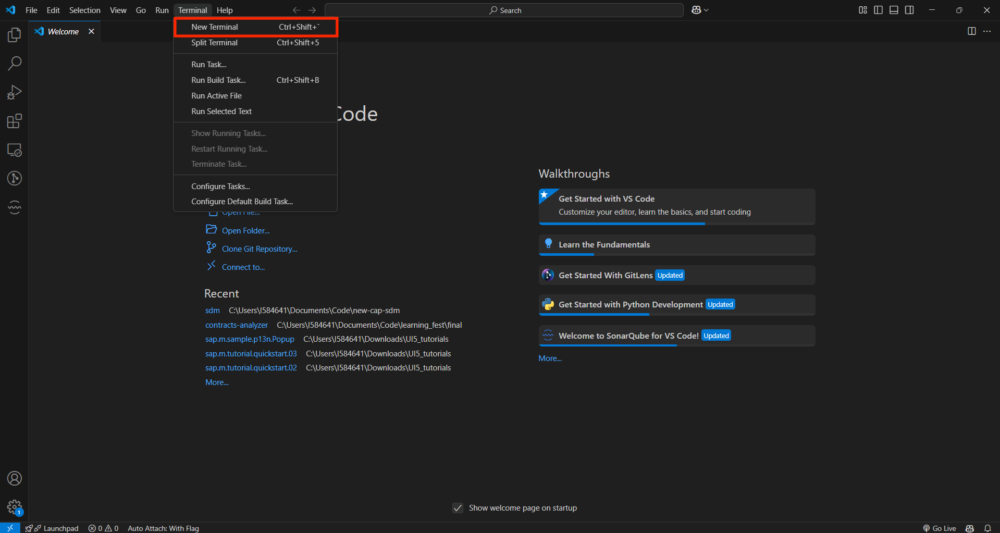
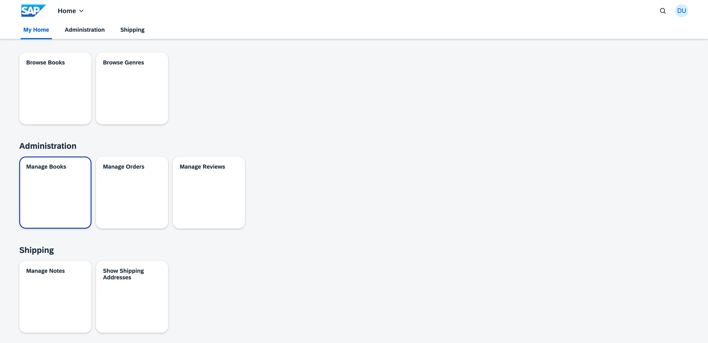
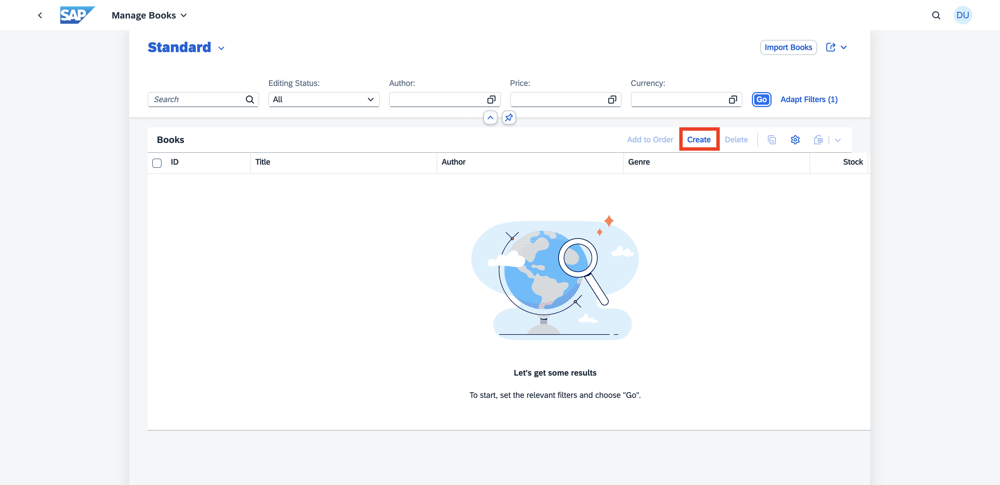
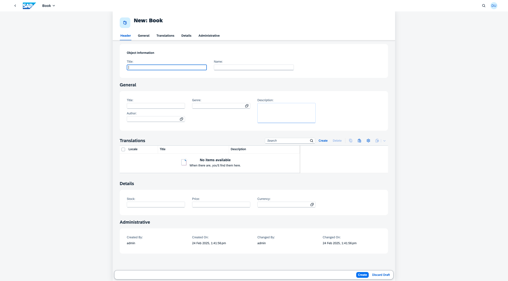

# Tutorial for SIT hands-on
The `com.sap.cds:sdm` dependency is a [CAP Java plugin](https://cap.cloud.sap/docs/java/building-plugins) that provides an easy CAP-level integration with [SAP Document Management Service](https://discovery-center.cloud.sap/serviceCatalog/document-management-service-integration-option). This package supports handling of attachments(documents) by using an aspect Attachments in SAP Document Management Service.  
This plugin can be consumed by the CAP application deployed on BTP to store their documents in the form of attachments in Document Management Repository.

## Table of Contents

- [Setting up the CAP Cloud Samples App](#Setting-up-the-CAP-Cloud-Samples-App)

## Setting-up-the-CAP-Cloud-Samples-App

In this guide, we use the CAP cloud samples app to use the SDM Plugin

### Testing the application locally

1. Open Visual Studio Code
2. Open a new terminal 



3. Execute the following commands

```sh
cd ~/Desktop
```
```sh
git clone https://github.com/rishikunnath2747/SIT-Hands-On.git
```
```sh
cd .\SIT-Hands-On\cloud-cap-samples-java\
```
```sh
mvn spring-boot:run
```
4. Wait for the application to start. Once it is running, in the terminal you will see logs similar to the example below.

```sh
   INFO 94355 --- [  restartedMain] o.s.b.d.a.OptionalLiveReloadServer       : LiveReload server is running on port 35729
   INFO 94355 --- [  restartedMain] o.s.b.w.embedded.tomcat.TomcatWebServer  : Tomcat started on port 8080 (http) with context path '/'
   INFO 94355 --- [  restartedMain] my.bookshop.Application                  : Started Application in 2.797 seconds (process running for 3.04)
```
5. Open this url in the browser : http://localhost:8080/fiori.html
6. Enter `admin` as both the username and password
7. Click on the “Manage Books” tile



8. Click on create button



9. This is how the UI looks like before integrating with SDM plugin. There is no option to upload any attachments.



10. In the terminal, hit ctrl+c to stop the running application. If prompted with `Terminate batch job (Y/N)?` enter `y`.

[REVISIT - ADD DETAILS EXPLAINING THE USE CASE OF PLUGIN]

### Integrating the application with the SDM Plugin

1. In the terminal execute the command given below 

```sh
   code -r .
```
2. If you are prompted with a dialog box with the following question : `"Do you trust the authors of the files in this folder?"`, click `"Yes, I trust the authors"`
3. From the explorer tab on the left open cloud-cap-samples-java/mta.yaml
4. Uncomment the commented lines on 
- Line102-106
- Line32
- Line25
And make sure to save the file
5. From the explorer tab on the left open cloud-cap-samples-java/srv/attachment-extension.cds, uncomment all the lines and save the file
6. From the explorer tab on the left open cloud-cap-samples-java/app/admin/fiori-service.cds, uncomment Line29-34 and save the file
7. From the explorer tab on the left open cloud-cap-samples-java/srv/pom.xml and uncomment Line20-24 and save the file 
8. Open the terminal and execute the following commands 

```sh
   mbt build
```
```sh
   cf deploy mta_archives/bookshop-sit-hands-on_1.0.0.mtar -f
``` 

9. Once the deployment is successful, open subaccount>space_name>Applications>bookshop-xx-app (xx is the number on the sticky note attached to your computer system, for e.g. bookshop-07-app) 
10. Open the Application Routes url [sample url] [REVISIT - ADD URL]
11. Click on Manage Books
12. Click on Create
13. Scroll down to the ATTACHMENTS section and click on upload
14. Select a file and click on Open [REVISIT - ADD TEST FILE TO ALL LAPTOPS]
15. Once you see the hyperlink with the file name in the Attachment column click on create. [REVISIT - READ/RENAME?]
